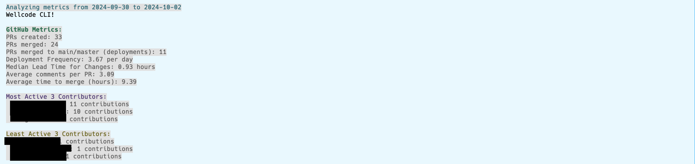
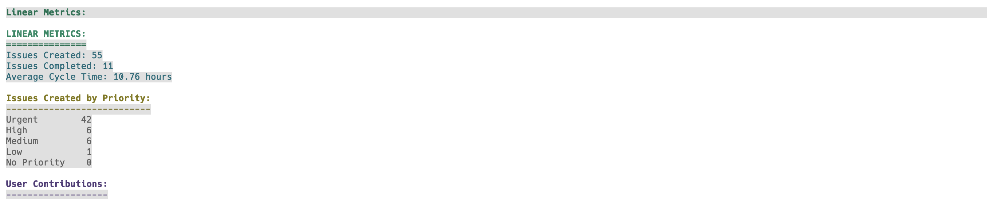
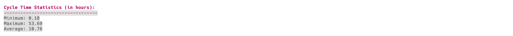
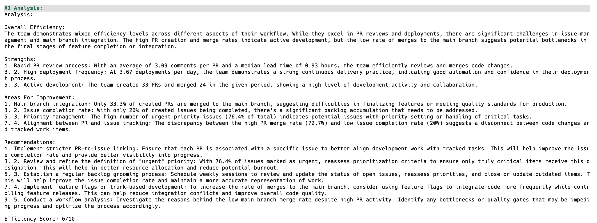

# Wellcode.ai - Engineering Metrics Script


wellcode.ai is a powerful script that integrates with GitHub, Linear, and Split.io to gather and analyze engineering team metrics. It helps identify productivity trends, potential blockers, and provides AI-powered insights into team performance.

## Our Mission

At [wellcode.ai](https://wellcode.ai), our goal is to democratize free metrics for engineering teams, enabling them to improve efficiency and performance. We believe that by providing accessible, data-driven insights, we can empower teams to make informed decisions, optimize their workflows, and foster a culture of continuous improvement.

Wellcode is designed to:
- Elevate code quality
- Reward contributors
- Provide AI-driven insights for optimized developer performance and team dynamics

By leveraging advanced AI technology, we aim to create a more efficient, productive, and rewarding environment for developers and engineering teams of all sizes.

## Privacy & Security

### Data Processing
- All metrics are processed locally on your machine
- No source code is ever accessed or analyzed
- Only metadata (PR counts, timestamps, etc.) is collected
- No code content or sensitive data is stored

### AI Integration
- Only aggregated metrics are sent to Claude AI
- No source code is ever shared with AI services
- No personal information is transmitted
- AI analysis focuses solely on performance patterns and trends

### Data Storage
- No data is stored on external servers
- Reports are generated locally
- All API tokens are stored securely in your local environment
- No tracking or usage analytics are collected

### Integration Security
- All API communications use secure HTTPS
- Read-only access to GitHub repositories
- Minimal scope API tokens recommended
- No write permissions required

We take your privacy seriously and ensure that:
- Your code remains private and secure
- Only necessary metadata is processed
- All analysis happens locally
- No sensitive information leaves your environment

## Features

### Data Collection & Analysis
- **GitHub Metrics**: 
  - PR statistics (created, merged, merged to main)
  - Time to merge analysis
  - Comments distribution
  - Lead times
  - User contributions
  - Review process metrics
  - Code quality indicators
  - Bottleneck identification

- **Linear Metrics**:
  - Issue tracking (created vs completed)
  - Cycle time analysis
  - Priority breakdown
  - Team workload distribution

- **Split.io Metrics**:
  - Feature flag usage
  - Environment distribution
  - Top feature flags
  - Change frequency
  - Error analysis

- **AI-Powered Insights**:
  - Performance trend analysis
  - Bottleneck detection
  - Team dynamics insights
  - Improvement recommendations
  - Comparative analysis

### Visualization
- Interactive HTML reports with:
  - Timeline charts
  - Distribution plots
  - Bar charts
  - Box plots
  - User contribution analysis
  - Priority breakdowns
  - Environment distributions

### AI-Powered Insights
- Trend analysis
- Performance indicators
- Bottleneck detection
- Team dynamics insights


## Prerequisites

- Python 3.7+
- Access to GitHub, Linear, and Split.io APIs
- Anthropic API access for AI analysis (optional)

## Installation

### Using Pip

The easiest way to install wellcode-cli is using pip:

```
pip install wellcode-cli
```

### Manual Installation

1. Clone this repository:
   ```
   git clone https://github.com/wellcode-ai/wellcode-cli.git
   cd wellcode-cli
   ```

2. Create a virtual environment and activate it:
   ```
   python -m venv venv
   source venv/bin/activate  # On Windows, use `venv\Scripts\activate`
   ```

3. Install the required packages:
   ```
   pip install -r requirements.txt
   ```

## Configuration

1. Run `wellcode-cli config` to configure your API keys.

2. Alternatively, create a `config.py` file in the project root with the following content:
   ```python
   GITHUB_TOKEN = 'your_github_token'
   GITHUB_ORG = 'your_github_organization'
   LINEAR_API_KEY = 'your_linear_api_key'
   SPLIT_API_KEY = 'your_split_api_key'
   ANTHROPIC_API_KEY = 'your_anthropic_api_key'  # For AI analysis
   ```

2. Replace the placeholder values with your actual API tokens and settings.

## Usage

### Basic Commands

1. Configure API keys:
```bash
wellcode-cli config
```

2. Start interactive mode:
```bash
wellcode-cli
```

3. Analyze metrics:
```bash
wellcode-cli review [--team TEAM] [--user USER] [--start-date DATE] [--end-date DATE]
```

4. Generate visual report:
```bash
wellcode-cli report [--output PATH] [--format html|pdf]

5. Chat with Wellcode:
```bash
wellcode-cli chat
```

### Report Generation Options

```bash
wellcode-cli report --output ./my-reports --format html
```

The report command generates an interactive HTML report with:
- PR Timeline visualization
- Issue statistics
- Feature flag metrics
- Team performance indicators
- And more...

### Interactive Mode Commands

When in interactive mode, you can:
- Ask questions about metrics: "how is team frontend performing?"
- Review specific periods: "check last month's performance"
- Generate reports: "generate html report"
- Analyze specific users: "show metrics for user johndoe"
- Get AI insights: "any suggestions for improvement?"

Examples:
```bash
# Direct commands
wellcode-cli review --team frontend --start-date 2024-03-01 --end-date 2024-03-31
wellcode-cli chat "how can we improve our PR review process?"
wellcode-cli report --format pdf --output ~/Desktop/metrics

# Interactive mode queries
> check team frontend metrics for last week
> how was john's performance yesterday
> generate report for last month
> what are our bottlenecks?
```

### Setting up Environment Variables

Before running the script, you need to set up the following environment variables:

```bash
export GITHUB_TOKEN='your_github_token'
export GITHUB_ORG='your_github_organization'
export LINEAR_API_KEY='your_linear_api_key'
export SPLIT_API_KEY='your_split_api_key'
export ANTHROPIC_API_KEY='your_anthropic_api_key'  # For AI analysis
```

Replace the placeholder values with your actual API tokens and settings.

### Running the Script

Once the environment variables are set, run the script with:

```bash
wellcode-cli [--user USERNAME]
```

Options:
- `--user USERNAME`: Filter metrics by a specific username

By default, the script will analyze data from the current week (Monday to today) and generate a report.

### Example

```bash
wellcode-cli --user johndoe
```

This command will generate a report for the user 'johndoe' based on the current week's data.

## Sample Output

### GitHub Metrics


### Linear Metrics


### Cycle Time Statistics


### AI Analysis



## Contributing

Please read CONTRIBUTING.md for details on our code of conduct and the process for submitting pull requests.

## License

This project is licensed under the MIT License - see the LICENSE.md file for details.

## Support

- Issues: [GitHub Issues](https://github.com/wellcode-ai/wellcode-cli/issues)
- Website: [wellcode.ai](https://wellcode.ai)


## Acknowledgments

- OpenAI for providing the AI analysis capabilities
- The teams behind GitHub, Linear, and Split.io for their excellent APIs

---

Built with ❤️ by [wellcode.ai](https://wellcode.ai)